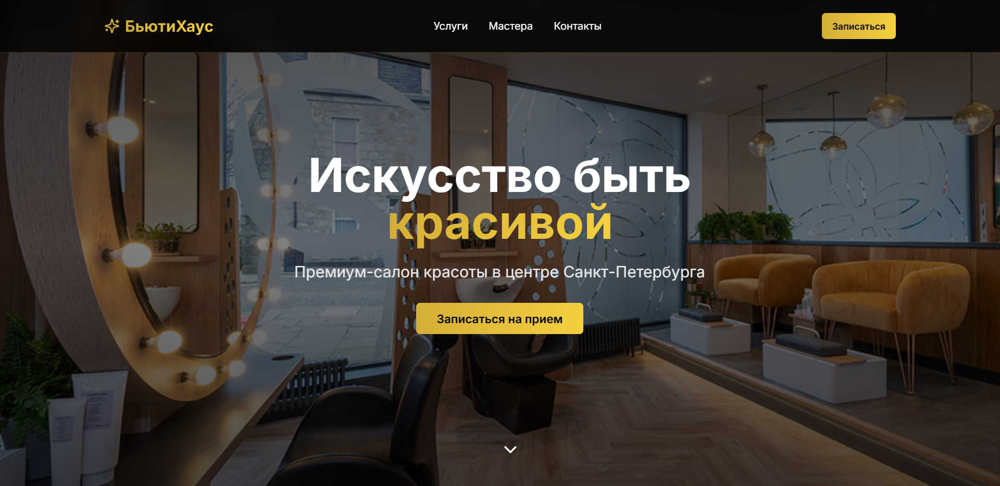
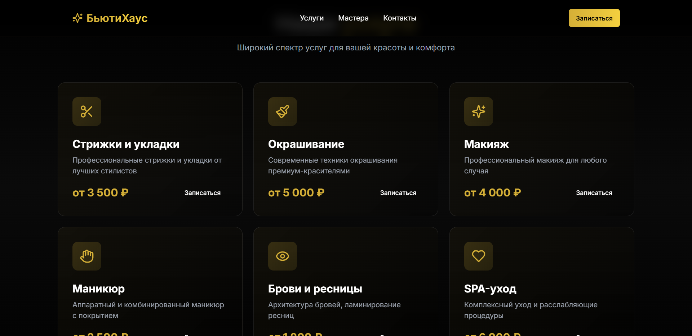
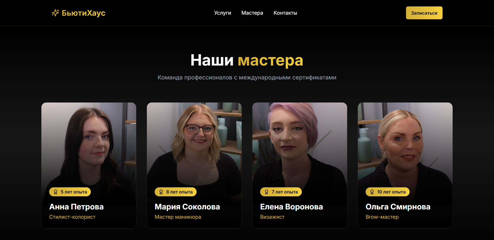
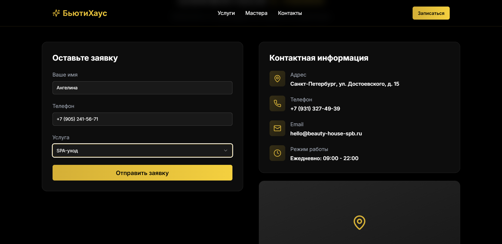
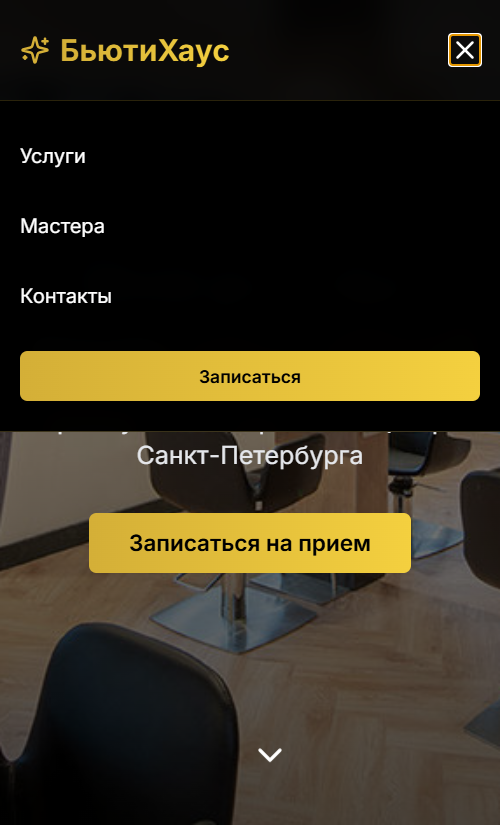
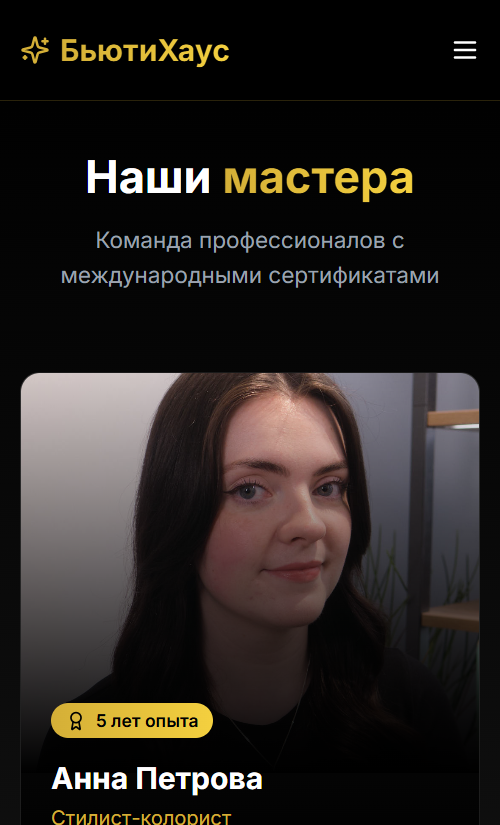
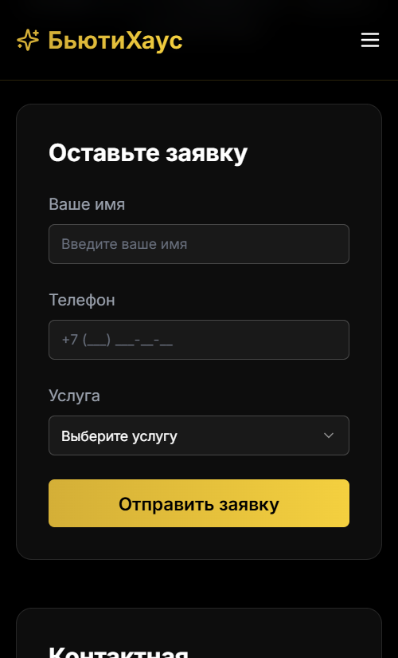
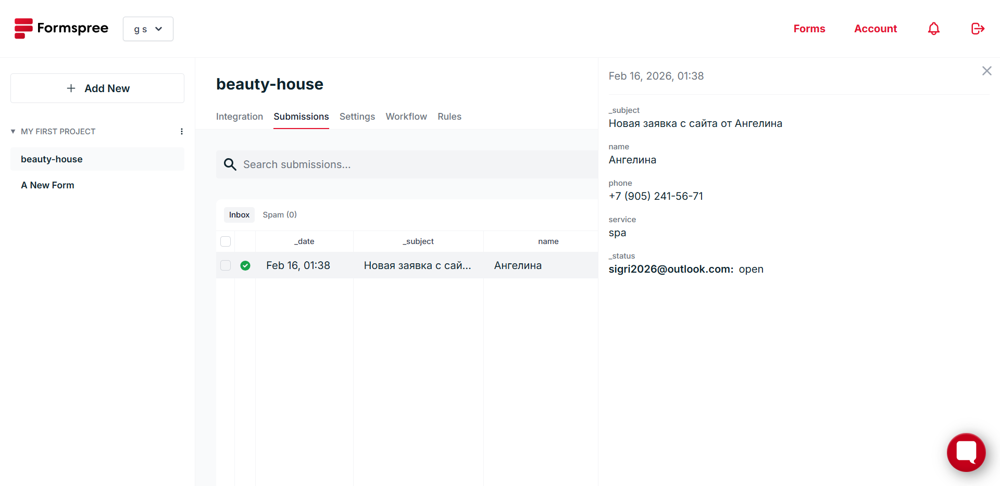
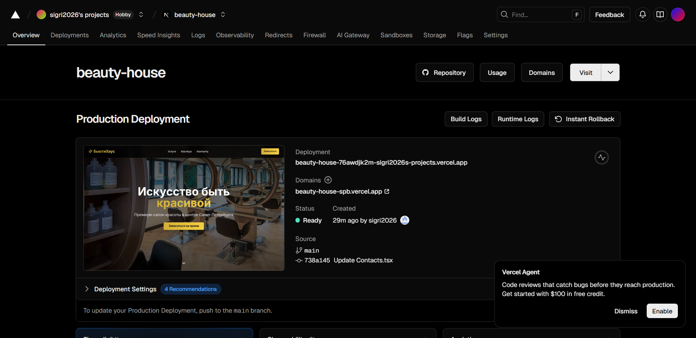

beauty-house
# БьютиХаус — сайт салона красоты (дипломный проект)

Разработано в рамках диссертации на тему:  
"Исследование эффективности применения технологий искусственного интеллекта для разработки ПО"

## Технологии
- Next.js 14
- Tailwind CSS
- React 18

## Функционал
- Адаптивный дизайн
- Карточки услуг и мастеров
- Форма онлайн-записи (Formspree)

## Ссылки
- Сайт: [https://beauty-house-spb.vercel.app](https://beauty-house-spb.vercel.app)

## Промты
- Сайт: [https://github.com/sigri2026/prompts](https://github.com/sigri2026/prompts)

## Скриншоты десктопной версии
| Страница | Скриншот |
| :--- | :--- |
| Главная |  |
| Услуги |  |
| Мастера |  |
| Форма записи |  |
| Успешная отправка |  |

## Скриншоты мобильной версии
| Страница | Скриншот |
| :--- | :--- |
| Главная |  |
| Меню (гамбургер) |  |
| Услуги |  |
| Мастера |  |
| Форма записи |  |

### Использованные сервисы

